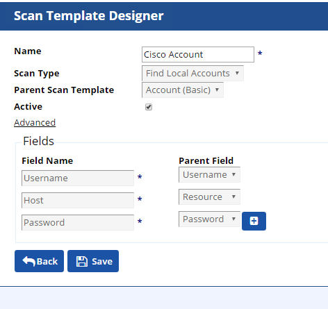
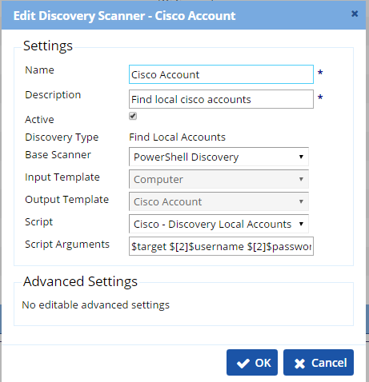
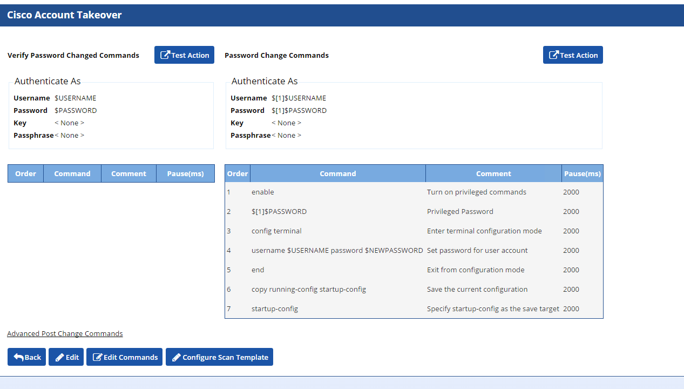
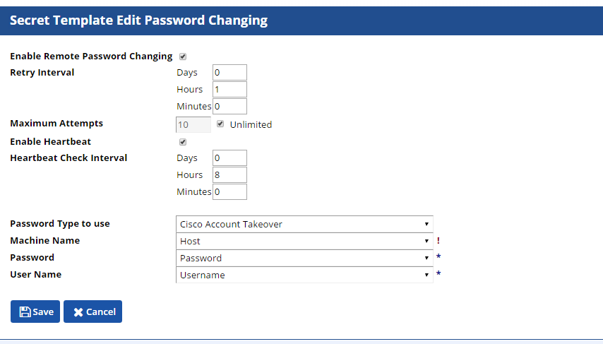
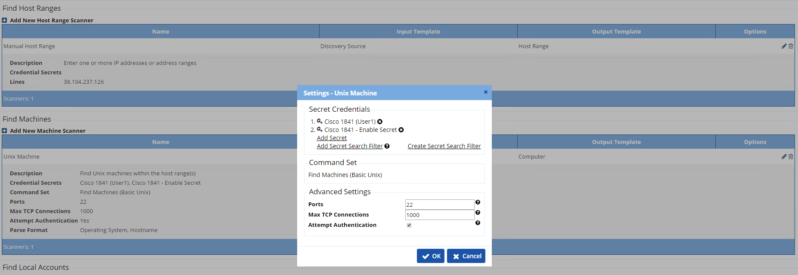
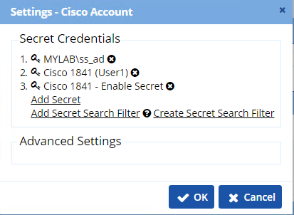

### Cisco Local Account Discovery

#### Summary
This script will authenicate to an IOS device with or without an enable password then run "show running-config | i user"; read the stream from ssh and extract accounts to be applied to secret server discovery.

##### Development Environment
| Environment | Version |
| ------ | ------ |
| Secret Server | 10.1+ |
| Operating System | Windows Server 2016 |
| PowerShell | Windows Management Framework 5 |
| Cisco IOS | C1841-IPBASEK9-M, V. 15.1(4)M4 |

#### Prerequisites: 
- Cisco IOS device with local users
- Cisco Account (SSH) to authenticate with
- Cisco Enable Secret (SSH) if necessary

#### Installation

1. Apply CiscoLocalAccounts script:
 - **ADMIN** > **Scripts**
2. Configure Scan Template: 
 - **ADMIN** > **Discovery** > **Extensible Discovery** > **Configure Scan Templates** >
 - **Local Accounts** > **Create New Scan Template**

3. Configure Discovery Scanner:
- **ADMIN** > **Discovery** > **Extensible Discovery** > **Configure Discovery Scanners** >
- **Local Accounts** > **Create New Scanner**
- **Output Template**: Select scan template from step 2
- **Script**: Select  script from step 1
- **Arguments**: $target $[2]$username $[2]$password $[3]$password

4. Configure Takeover
- **ADMIN** > **Remote Password Changing** > **Configure Password Changers** > **+New**
- **Base Password Changer**: Cisco Account Custom (SHH)
- **Name**: Cisco Account Takeover

- **Edit** > Enable **Valid for Discovery Import**

5. Assign Password Changer
- **ADMIN** > **Secret Templates** > **Cisco Account (SSH)** > 
- **Edit** > **Configure Password Changing** > **Edit**
- **Password Type to use**: Cisco Account Takeover

6. Add Discovery Source
- **ADMIN** > **Discovery** > **+Create New** > **Unix Discovery Source**
- **Name**: Cisco Networking
- **Scan Range**: IP Address
- Apply prerequisite secret(s) for authentication

- Remove **Unix Non-Daemon User** scanner
- **Add New Local Account Scanner** > Choose scanner from step 3
- Apply **Secret Credentials**
    1. Account to run powershell script
    2. Account to authenticate to Cisco endpoint
    3. Account with enable password if applicable

7. Run Discovery
- Import located accounts
