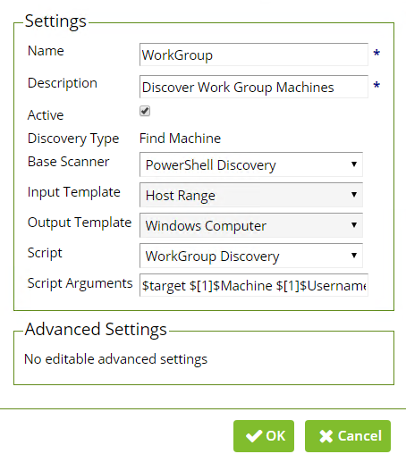
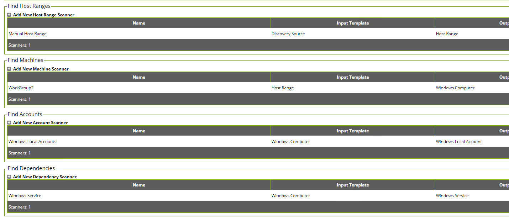

# WorkGroup Discovery

## Purpose

This script is an alternate Machine Scanner that will return machines from an IP address range that are not domain joined.
 
## Pre-Requisites: Powershell Remoting
 
Ensure WinRM is configured on the Secret Server:

https://thycotic.force.com/support/s/article/Configuring-WinRM-for-PowerShell
 
Ensure that CredSSP is enabled as Server on Secret Server machine:

https://thycotic.force.com/support/s/article/Configuring-CredSSP-for-use-with-WinRM-PowerShell
 
**Note:** In order to conduct Powershell Remoting to non-domain Joined Machines, you will either create an HTTPS WinRM Listener, or you need to specify all of the WorkGroup Machines in your Trusted Hosts file for WinRM. The Trusted Hosts approach is not recommended could create some security vulnerabilities. Instead, WinRM Listeners can be configured for HTTPS to allow this traffic by default.
 
## Create an HTTPS WinRM new Listener
 
+	All command listed below can be run from an administrative Powershell session.
+	View current WinRM Listener Configuration:
+	winrm e winrm/config/listener
  +	NOTE: The certificate used must not be self-signed, it must have server/ client auth and contain appropriate FQDN of the Secret Server machine (Or the Distributed Engine if discovery is being run to a Site).
+	Create a new WinRM listener with the following information:
    +	winrm create winrm/config/Listener?Address=*+Transport=HTTPS  '@{Hostname="fqdn.of.SecretServer(Or Distributed Engine)";CertificateThumbprint="xxxxxxxxxxxxxxxxxxxxxxxxxxxxxxxxxxxxxxxxxxxxxxxxxxx"}'
    +	Note: Copying from the CertManager will include one extra character in front of the thumbprint that needs to be deleted. 
## Creating the Scanner:
+	Navigate to Admin > Scripts > Create New
+	Paste in the Powershell from workgroupdiscovery.ps1.
+	Once the script is in place, create the machine scanner:
    +	Admin > Discovery > Extensible Discovery > Discovery Scanners > Machines > Create New Scanner
+	Create the Scanner using the powershell script that we imported in the previous step.
 
  
 
+	The script will use the following arguments:
    +	$target $[1]$Machine $[1]$Username $[1]$Password

## Creating a WorkGroup Discovery Source

 Navigate to Admin > Discovery > Edit Discovery Sources > Create New
+	Choose "Unix Discovery Source" For the Discovery Type. This seems counter intuitive, but it will default to an IP address Scanner. 
+	Follow the wizard and give the discovery source a Name, IP Address range to scan, and skip over the credential page. 
+	On the Discovery Source Page, Delete any entries under "Find Machines", "Find Accounts", and "Find Dependencies"

 

+	Create a new Machine Scanner, using the WorkGroup Machine scanner created earlier. You will be able to use the default Windows Local Account / Dependency scanners with this machine scanner. 
**Note:** If each of the machines you will be scanning has a different local administrator password, you will need to create a Secret Search Filter in order to dynamically assign the proper credentials to access and pull information from the WorkGroup Machines. https://thycotic.force.com/support/s/article/Discovery-Secret-Search-Filter 

