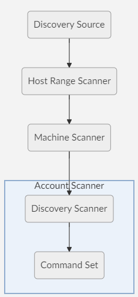
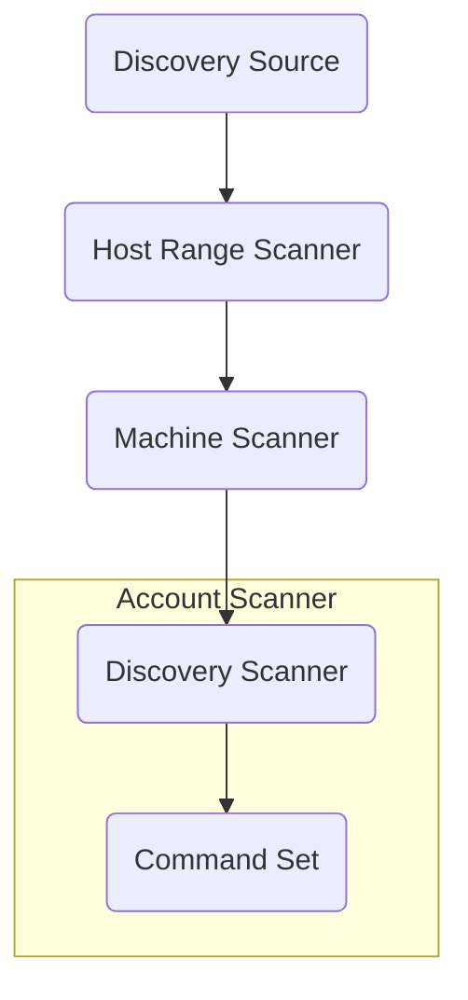
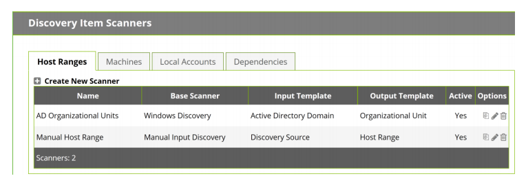
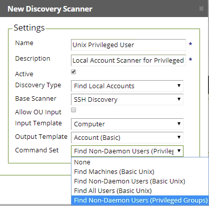

## Summary
This article will instruct a Secret Server administrator on how to create a custom command set and a custom discovery scanner to locate users within a specific group in Unix/Linux. In this example we will be targeting users in the wheel group on CentOS 7.

## Unix/Linux Discovery 

Secret Server is given a list of IP address ranges on the network to scan for. It will look for computers that are listening on the specified ports (default is 22). Secret Server will then attempt to use DNS to resolve the list of IP’s that are found with the goal of providing a more easily recognizable computer name. All computers found will be saved in the Secret Server database. Secret Server then attempts to connect to each computer using the provided credentials and query for the list of users on the target system.

#### Prerequisites
This article assumes a Unix/Linux Discovery Source has already been defined, along with an account with permissions to run the necessary commands. Please reference the Secret Server Discovery Guide for instructions on how to define a Unix/Linux Discovery Source and necessary permissions. 

#### Test Environment
| Environment |Version  |
|--|--|
|Secret Server| 10.6 |
|O/S| CentOS Linux 7.6.1810 (Core)|

## Discovery Logical Workflow
The below workflow is a high-level view of the flow specific to this custom scanner.

The items in blue are the items we will be addressing in this article. 

## Account Scanner "Find Local Accounts"
Use SSH to Find Unix Local Accounts on machines discovered in your host ranges. 
- **Credentials Secrets** Select the credentials to be used to scan with. These credentials may be Generic Discovery Credentials or a Unix Account (SSH) type Secret. You can add multiple accounts here. 
- **Command Set** The command set is defined on the discovery scanner. To change command sets, create a new item scanner. Command sets are Unix commands that will be used to gather information from them machine when it is scanned for Discovery. Commands for Local Account Discovery are always enabled and a Credential Secret is required for the Find Local Account settings. The default command set is Find Non-Daemon Users (Basic Unix). This will extract the non-built-in Unix users. 
- **Ports** This is a comma-separated list of port values (1-65535). SSH generally uses port 22. The default port used when attempting to scan a machine for users. This will be overridden by a specific port found during machine scanning. 
- **User Regex Format** This regular expression determines which lines of text received during the scan are actually valid for user parsing. The match groups in the regular expression should correspond to the comma-separated items in the Parse Format. 
- **Parse Format** The Parse Format determines the order of the values that will be retrieved during a scan. If the parse names match the fields defined on the Secret imported, they will be populated from the data collected on the scan. 
- **Newline Separator Character** This character will divide the lines in the output encountered during a scan. 

**Note** If you use an IP address (instead of a host name) as the basis for a Secret and configure discovery rules for that IP address then you may create a potential problem for Secret Server and the machines associated with that account.

## Discovery Scanners

Discovery Scanners define how a specific item – host range, machine, account, or dependency – is discovered. The “Discovery Scanners” page contains a tab for each scan step and built-in scanners for the default scan actions.

This article will focus on the "Local Accounts" tab.

## Discovery Command Sets
Discovery command sets are customizable sets of commands that are sent over an SSH connection to the machines being accessed by Discovery. 

The commands in a Discovery Set will be executed sequentially in the order they are listed, but only the output of the final command will be returned. 

## Instructions

#### Create a New Command Set

 1. Navigate to **Admin** > **Discovery** 
 2. Select **Edit Discovery Sources**
 3. Select **Configure Command Sets**
 4. Click on **+ Create New** to launch

#### Configuring a New Command Set

 1. Enter a Name 
 2. Change **Scan Type** to **Find Local Accounts**
 3. Click on **Save**

#### Enter Commands

 1. Enter a commands and comments
 2. Click on **+** if additional lines are needed
 3. Click on **Save** 

**Note:** There are various methods to parse users in privileged groups. The below is for education purposes and are specific to the test environment. Please contact your Linux/Unix Administrator on the appropriate commands necessary in your environment. The below command is targeting users who are in the wheel group specifically.

` privUsers=$(getent passwd | cut -d : -f 1 | xargs groups | grep wheel | awk {'print $1'})`

` getent passwd $privUsers` 

  
 #### Configure Discovery Scanner

 1. From the Discovery Command Sets screen, click on **Back**
 2. Now on the Discovery Sources screen, click on **Configure Discovery Scanners**
 3. Click on the **Local Accounts** tab
 4. Click on **+ Create New Scanner**
 5. Enter a Name & Description for the Discovery Scanner
 6. Leave the Discovery Type, Base Scanner, Allow OU Input, Input Template, and Output Template at the default values
 7. Select the previously created Command Set 

#### Configure Discovery Source - Account Scanner

 1. Navigate to **Admin** > **Discovery** 
 2. Select your Unix/Linux Discovery Source
 3. Click on the **Trash** icon to the right of your "Find Accounts" Scanner to delete
 4. Click on **+ Add New Account Scanner **
 5. Select the Scanner created in the previous step

#### Configure Discovery Source - Scanner Settings

 1. Choose an account which has permissions to run the commands listed in the command set. (This example uses root, but it is not necessary to use this account)
 2. If all other settings are appropriate click on **OK**

#### View Accounts
 1. Navigate to **ADMIN** > **Discovery** > **Discovery Network View**
 2. Select your Unix/Linux Discovery Source on the left column
 3. Click on the hostname/IP of your test endpoint
