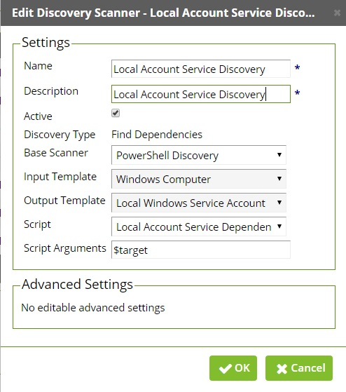
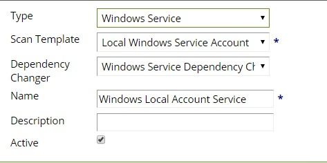

Add the Script "LocalAccountServiceDiscovery.ps1" to Secret Server under Admin > Scripts > Powershell Tab > Create New

Paste the script into the box, and give it a name.

Next we need to configure the other basic components for extensible discovery:

Scan Template
Navigate to Admin > Discovery > Extensible Discovery > Configure Scan Templates > Dependencies tab
Select “Create New Scan Template” and input the settings from the script, “Machine, ServiceName, and UserName” are all that’s required.

Click Save.

Discovery Scanner

Navigate to Admin > Discovery > Extensible Discovery > Configure Discovery Scanners > Dependencies tab
Select Create New Scanner
Enter the following settings, choose the script you imported in the first section.
	 

Dependency Template

Navigate to Admin > Discovery > Extensible Discovery > Configure Dependency Templates > Create New Dependency Template with the following settings. Ensure that you choose the scan template you created earlier.

Add the discovery Scanner to your Discovery Source:
Navigate to Admin > Discovery > Edit Discovery Sources > Choose the domain you’d like to discovery on > Scanner Settings > Find Dependencies > Add New Dependency Scanner
Associate You can use the same Account for normal Service Account Discovery on this scanner.
